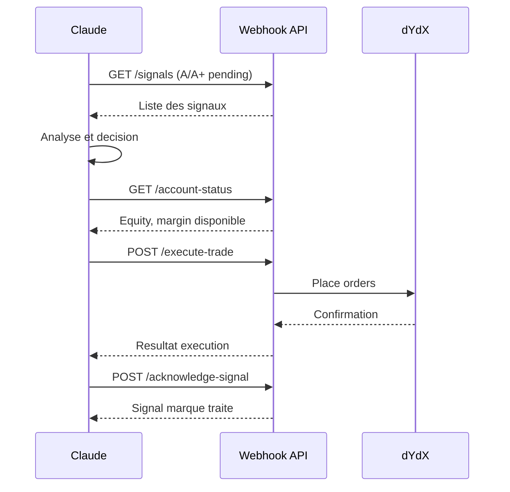

# Bull Sage - Webhook API Documentation

**Version**: 2.0.0
**Base URL**: `https://your-domain.com/api/webhook`

---

## Overview

L'API Webhook permet l'automatisation des trades sur dYdX via des systemes externes comme Claude, des bots, ou d'autres services.

### Securite

Toutes les requetes doivent inclure le header d'authentification:

```
X-Claude-Token: votre_token_webhook
```

Le token est configure via la variable d'environnement `CLAUDE_WEBHOOK_TOKEN`.

### Rate Limiting

- **Limite**: 10 requetes par minute par IP
- **Header de reponse**: `X-RateLimit-Remaining`

### Codes d'erreur communs

| Code | Signification |
|------|---------------|
| `TRADING_DISABLED` | Trading desactive |
| `MARKET_NOT_ALLOWED` | Marche non autorise |
| `LOW_CONFIDENCE` | Score de confiance insuffisant |
| `STOP_LOSS_REQUIRED` | Stop loss obligatoire |
| `COOLDOWN_ACTIVE` | Cooldown entre trades actif |
| `INSUFFICIENT_MARGIN` | Margin insuffisant |
| `RISK_TOO_HIGH` | Risque depasse le maximum |

---

## Endpoints

### 1. Execute Trade

Execute un trade sur dYdX avec validation complete.

**Endpoint**: `POST /api/webhook/execute-trade`

**Headers**:
```
Content-Type: application/json
X-Claude-Token: votre_token
```

**Body**:
```json
{
  "market": "BTC-USD",
  "direction": "LONG",
  "size": 0.01,
  "stopLoss": 90000,
  "takeProfit": 105000,
  "confidence": 85,
  "source": "claude",
  "signal_id": "sig_123",
  "metadata": {
    "strategy": "breakout"
  }
}
```

**Parametres**:

| Champ | Type | Requis | Description |
|-------|------|--------|-------------|
| `market` | string | Oui | Marche (BTC-USD, ETH-USD, etc.) |
| `direction` | string | Oui | LONG ou SHORT |
| `size` | float | Non* | Taille en crypto |
| `size_usdc` | float | Non* | Taille en USDC |
| `size_percent` | float | Non* | Taille en % du capital |
| `stopLoss` | float | Oui | Prix du stop loss |
| `takeProfit` | float | Non | Prix du take profit |
| `confidence` | int | Non | Score 0-100 (defaut: 80) |
| `source` | string | Non | Source du signal |
| `signal_id` | string | Non | ID du signal original |
| `metadata` | object | Non | Donnees supplementaires |

*Au moins un parametre de taille requis

**Exemple curl**:
```bash
curl -X POST "https://api.bullsage.com/api/webhook/execute-trade" \
  -H "Content-Type: application/json" \
  -H "X-Claude-Token: votre_token" \
  -d '{
    "market": "BTC-USD",
    "direction": "LONG",
    "size_percent": 2.0,
    "stopLoss": 92000,
    "takeProfit": 102000,
    "confidence": 85,
    "source": "claude_analysis"
  }'
```

**Reponse succes**:
```json
{
  "success": true,
  "checks": {
    "market": "OK",
    "confidence": "OK",
    "stop_loss": "OK",
    "cooldown": "OK",
    "risk": "OK (1.85%)"
  },
  "account": {
    "equity": 1000,
    "margin_available": 800
  },
  "calculated_size": 0.0215,
  "execution": {
    "success": true,
    "orders": [
      {"type": "ENTRY", "success": true, "price": 95000},
      {"type": "STOP_LOSS", "success": true, "price": 92000},
      {"type": "TAKE_PROFIT", "success": true, "price": 102000}
    ]
  },
  "timestamp": "2025-01-08T10:30:00Z"
}
```

**Reponse erreur**:
```json
{
  "success": false,
  "error": "Risque trop eleve: 3.5% > max 2%",
  "code": "RISK_TOO_HIGH",
  "risk_details": {
    "risk_amount": 35,
    "risk_percent": 3.5,
    "max_allowed": 2.0
  }
}
```

---

### 2. Get Positions

Recupere les positions ouvertes avec PnL.

**Endpoint**: `GET /api/webhook/positions`

**Exemple curl**:
```bash
curl -X GET "https://api.bullsage.com/api/webhook/positions" \
  -H "X-Claude-Token: votre_token"
```

**Reponse**:
```json
{
  "success": true,
  "wallet": "dydx1abc...",
  "equity": 1250.50,
  "freeCollateral": 950.25,
  "marginUsed": 300.25,
  "positionsCount": 2,
  "totalUnrealizedPnl": 45.30,
  "positions": [
    {
      "market": "BTC-USD",
      "side": "LONG",
      "size": 0.02,
      "entryPrice": 94500,
      "currentPrice": 95800,
      "unrealizedPnl": 26.00,
      "pnlPercent": 1.38,
      "status": "WINNING",
      "stopLoss": {"price": 92000, "orderId": "ord_123"},
      "takeProfit": {"price": 100000, "orderId": "ord_124"},
      "hasProtection": true
    },
    {
      "market": "ETH-USD",
      "side": "LONG",
      "size": 0.5,
      "entryPrice": 3200,
      "currentPrice": 3238,
      "unrealizedPnl": 19.30,
      "pnlPercent": 1.19,
      "status": "WINNING",
      "stopLoss": null,
      "takeProfit": null,
      "hasProtection": false
    }
  ],
  "unprotectedPositions": 1,
  "timestamp": "2025-01-08T10:30:00Z"
}
```

---

### 3. Get Pending Signals

Recupere les signaux A/A+ non traites.

**Endpoint**: `GET /api/webhook/signals`

**Query params**:
| Param | Type | Defaut | Description |
|-------|------|--------|-------------|
| `hours` | int | 2 | Heures a considerer |

**Exemple curl**:
```bash
curl -X GET "https://api.bullsage.com/api/webhook/signals?hours=4" \
  -H "X-Claude-Token: votre_token"
```

**Reponse**:
```json
{
  "success": true,
  "signals": [
    {
      "id": "sig_abc123",
      "symbol": "BTC",
      "symbol_name": "Bitcoin",
      "signal_type": "LONG",
      "entry_price": 95000,
      "stop_loss": 92000,
      "take_profit_1": 100000,
      "confidence": 88,
      "grade": "A+",
      "reason": "Breakout RSI + MACD bullish",
      "created_at": "2025-01-08T09:15:00Z",
      "status": "active"
    }
  ],
  "count": 1,
  "cutoff": "2025-01-08T06:30:00Z",
  "allowed_grades": ["A+", "A"],
  "min_confidence": 80
}
```

---

### 4. Close Position

Ferme une position ouverte.

**Endpoint**: `POST /api/webhook/close-position`

**Body**:
```json
{
  "market": "BTC-USD",
  "reason": "take_profit_manual"
}
```

**Exemple curl**:
```bash
curl -X POST "https://api.bullsage.com/api/webhook/close-position" \
  -H "Content-Type: application/json" \
  -H "X-Claude-Token: votre_token" \
  -d '{
    "market": "BTC-USD",
    "reason": "signal_reversal"
  }'
```

**Reponse**:
```json
{
  "success": true,
  "market": "BTC-USD",
  "side": "LONG",
  "size": 0.02,
  "closePrice": 95800,
  "reason": "signal_reversal",
  "cancelledOrders": 2,
  "timestamp": "2025-01-08T10:35:00Z"
}
```

---

### 5. Account Status

Recupere le statut complet du compte.

**Endpoint**: `GET /api/webhook/account-status`

**Exemple curl**:
```bash
curl -X GET "https://api.bullsage.com/api/webhook/account-status" \
  -H "X-Claude-Token: votre_token"
```

**Reponse**:
```json
{
  "success": true,
  "equity": 1250.50,
  "margin_used": 300.25,
  "margin_available": 950.25,
  "open_positions_count": 2,
  "total_unrealized_pnl": 45.30,
  "network": "testnet",
  "timestamp": "2025-01-08T10:30:00Z",
  "trading_config": {
    "enabled": true,
    "max_risk_percent": 2.0,
    "max_positions": 5,
    "cooldown_seconds": 60
  }
}
```

---

### 6. Acknowledge Signal

Marque un signal comme traite.

**Endpoint**: `POST /api/webhook/acknowledge-signal/{signal_id}`

**Body**:
```json
{
  "action": "EXECUTED",
  "notes": "Trade execute avec succes"
}
```

**Actions possibles**:
- `EXECUTED`: Signal execute
- `REJECTED`: Signal rejete (raison dans notes)
- `SKIPPED`: Signal ignore

**Exemple curl**:
```bash
curl -X POST "https://api.bullsage.com/api/webhook/acknowledge-signal/sig_abc123" \
  -H "Content-Type: application/json" \
  -H "X-Claude-Token: votre_token" \
  -d '{
    "action": "EXECUTED",
    "notes": "Trade BTC-USD LONG execute"
  }'
```

**Reponse**:
```json
{
  "success": true,
  "signal_id": "sig_abc123",
  "action": "EXECUTED",
  "acknowledged_at": "2025-01-08T10:32:00Z"
}
```

---

### 7. Health Check

Verifie l'etat du systeme webhook.

**Endpoint**: `GET /api/webhook/health`

**Exemple curl**:
```bash
curl -X GET "https://api.bullsage.com/api/webhook/health" \
  -H "X-Claude-Token: votre_token"
```

**Reponse**:
```json
{
  "status": "ok",
  "webhook_enabled": true,
  "trading_enabled": true,
  "dydx_executor": "ok",
  "rate_limit_remaining": 8,
  "timestamp": "2025-01-08T10:30:00Z"
}
```

---

## Configuration

### Variables d'environnement

| Variable | Description | Defaut |
|----------|-------------|--------|
| `CLAUDE_WEBHOOK_TOKEN` | Token d'authentification | - |
| `MAX_RISK_PERCENT` | Risque max par trade | 2.0 |
| `MAX_LEVERAGE` | Levier maximum | 10 |
| `MIN_CONFIDENCE` | Confiance minimale | 80 |
| `TRADE_COOLDOWN_SECONDS` | Cooldown entre trades | 60 |
| `MAX_SLIPPAGE_PERCENT` | Slippage maximum | 1.0 |
| `ALLOWED_MARKETS` | Marches autorises | BTC-USD,ETH-USD,... |

### Marches autorises par defaut

- BTC-USD
- ETH-USD
- SOL-USD
- AVAX-USD
- DOGE-USD
- XRP-USD
- ADA-USD
- DOT-USD
- LINK-USD
- MATIC-USD

---

## Workflow d'automatisation typique



---

## Logging

Tous les appels webhook sont loges dans MongoDB:

**Collection**: `webhook_logs`

```json
{
  "id": "log_123",
  "timestamp": "2025-01-08T10:30:00Z",
  "endpoint": "/execute-trade",
  "method": "POST",
  "client_ip": "1.2.3.4",
  "request": {...},
  "response": {...},
  "status": "success",
  "execution_time_ms": 1250
}
```

**Collection**: `trade_journal`

```json
{
  "id": "trade_123",
  "signal_id": "sig_abc",
  "timestamp": "2025-01-08T10:30:00Z",
  "market": "BTC-USD",
  "direction": "LONG",
  "entry_price": 95000,
  "stop_loss": 92000,
  "take_profit": 100000,
  "size": 0.02,
  "source": "webhook",
  "execution": {...},
  "status": "OPEN"
}
```

---

## Support

Pour toute question ou probleme:
- GitHub Issues: https://github.com/bullsage/issues
- Documentation: https://docs.bullsage.com

---

*Documentation generee automatiquement - Bull Sage v2.0*
